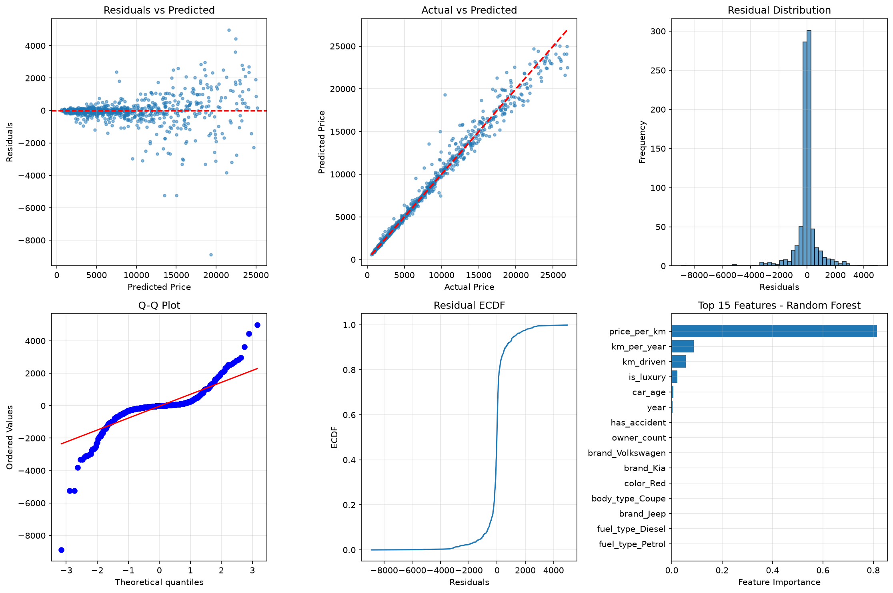
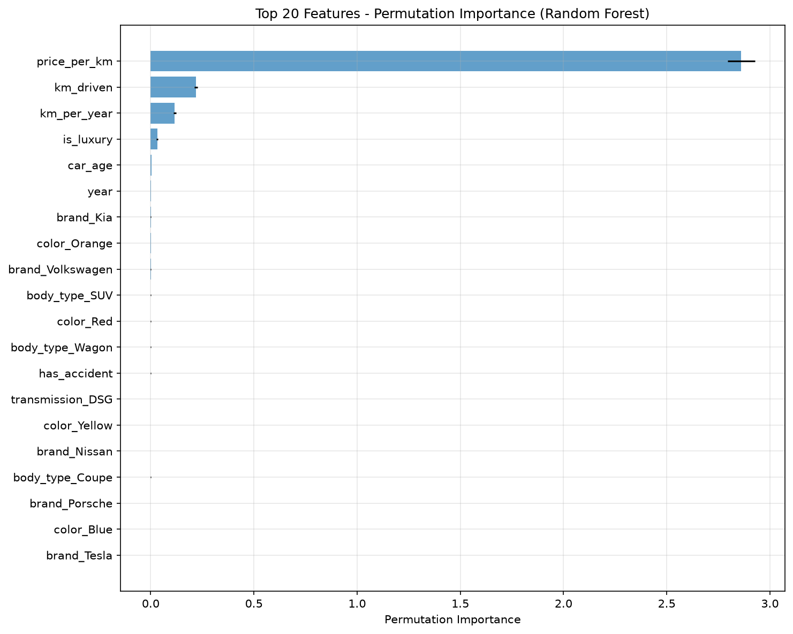
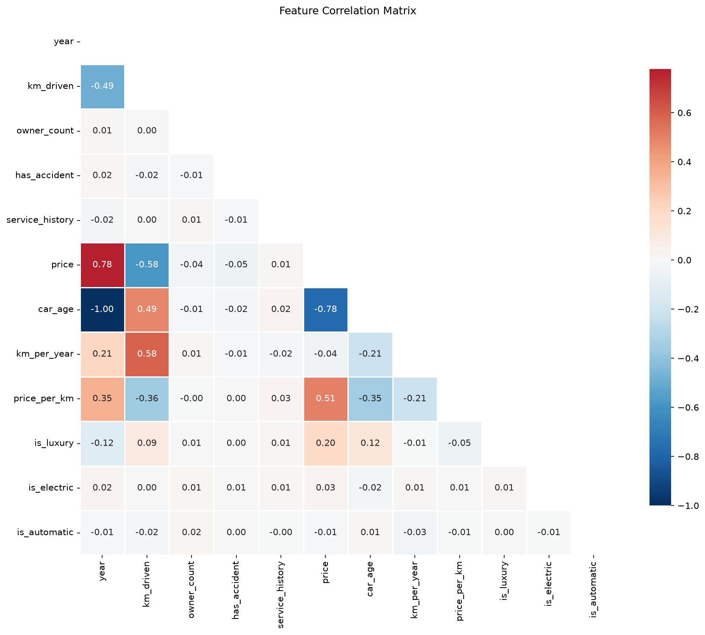

# 🚗 Used Car Price Prediction System

[](https://python.org)
[](https://scikit-learn.org)
[](https://streamlit.io)
[](LICENSE)

> **End-to-end machine learning pipeline** for predicting used car resale prices with interactive web application.

---

## 📋 Table of Contents

- [Project Overview](#-project-overview)
- [Dataset](#-dataset)
- [Methodology](#-methodology)
- [Model Performance](#-model-performance)
- [Key Findings](#-key-findings)
- [Installation](#-installation)
- [Usage](#-usage)
- [Project Structure](#-project-structure)
- [Technical Details](#-technical-details)
- [Future Work](#-future-work)

---

## 🎯 Project Overview

This project builds a **production-ready machine learning system** that predicts the resale price of used cars based on vehicle attributes. The pipeline covers the complete ML lifecycle: data generation, cleaning, feature engineering, model training, evaluation, and deployment via an interactive Streamlit web application.

### Business Problem
Used car pricing is complex due to:
- **Depreciation curves** varying by brand, age, and mileage
- **Market dynamics** (fuel type trends, transmission preferences)
- **Vehicle condition** (accidents, service history, ownership)
- **Non-linear interactions** between features

### Solution
A **Random Forest Regressor** achieving **R² = 0.981** on held-out test data, deployed as an interactive web app for real-time predictions.

---

## 📊 Dataset

### Source
Synthetically generated dataset (`car_data.csv`) with **5,000 samples** simulating realistic Indian used car market conditions.

| Feature | Type | Description |
|---------|------|-------------|
| `brand` | Categorical | 20 brands (Toyota, BMW, Mercedes, Tesla, etc.) |
| `year` | Numerical | Manufacturing year (2010–2024) |
| `km_driven` | Numerical | Odometer reading (1,000–300,000 km) |
| `fuel_type` | Categorical | Petrol, Diesel, Hybrid, Electric, CNG |
| `transmission` | Categorical | Manual, Automatic, CVT, DSG |
| `body_type` | Categorical | Sedan, SUV, Hatchback, Coupe, Convertible, Wagon, Pickup |
| `color` | Categorical | 10 color options |
| `owner_count` | Numerical | 1–4 previous owners |
| `has_accident` | Binary | Accident history (0/1) |
| `service_history` | Binary | Complete service records (0/1) |
| `price` | **Target** | Resale price in INR |

### Data Quality Issues (Intentionally Injected)
- **3% missing values**: `km_driven` (1.5%), `service_history` (1.5%)
- **1% outliers**: Extreme prices (3–5×) and unrealistic low mileage

---

## 🔬 Methodology

### 1. Data Cleaning
```python
# Missing value imputation
Numeric → Median imputation
Categorical → Mode imputation

# Outlier removal (two-stage)
Stage 1: IQR method (1.5× IQR) on price & km_driven
Stage 2: Z-score (|z| > 3) on price, km_driven, year
```
**Result**: 5,000 → ~4,700 clean samples (6% removed)

### 2. Feature Engineering
| Engineered Feature | Formula | Rationale |
|-------------------|---------|-----------|
| `car_age` | 2024 − year | Direct depreciation driver |
| `km_per_year` | km_driven / car_age | Usage intensity |
| `price_per_km` | price / km_driven | Value density metric |
| `is_luxury` | Brand ∈ {BMW, Mercedes, Audi, Lexus, Porsche, Tesla, Volvo} | Brand premium |
| `is_electric` | fuel_type == Electric | EV market dynamics |
| `is_automatic` | transmission ∈ {Auto, CVT, DSG} | Convenience premium |

### 3. Categorical Encoding
- **Label Encoding**: For tree-based models (preserves ordinal info)
- **One-Hot Encoding** (drop_first=True): For linear models (52 features after encoding)

### 4. Model Training
| Model | Preprocessing | Hyperparameters |
|-------|--------------|-----------------|
| Linear Regression | StandardScaler | — |
| Ridge | StandardScaler | α = 1.0 |
| Lasso | StandardScaler | α = 0.1, max_iter = 5000 |
| Decision Tree | None | max_depth=15, min_samples_split=10 |
| **Random Forest** | **None** | **n_estimators=200, max_depth=20, min_samples_split=5** |

**Validation**: 80/20 train-test split + 5-fold cross-validation (random_state=42)

### 5. Evaluation Metrics
- **MAE** (Mean Absolute Error) — interpretable in ₹
- **RMSE** (Root Mean Squared Error) — penalizes large errors
- **R²** (Coefficient of Determination) — variance explained

---

## 🏆 Model Performance

### Test Set Results (Hold-out 20%)

| Model | MAE (₹) | RMSE (₹) | R² | CV R² (mean ± std) |
|-------|---------|----------|-----|-------------------|
| **Random Forest** | **428** | **869** | **0.981** | **0.974 ± 0.008** |
| Decision Tree | 716 | 1,413 | 0.949 | 0.946 ± 0.010 |
| Lasso | 2,106 | 2,777 | 0.805 | 0.811 ± 0.011 |
| Ridge | 2,106 | 2,777 | 0.805 | 0.811 ± 0.011 |
| Linear Regression | 2,106 | 2,777 | 0.805 | 0.811 ± 0.011 |

> **Random Forest outperforms all baselines by a wide margin** — captures complex non-linear interactions between brand, age, mileage, and condition.

### Residual Analysis (Best Model: Random Forest)
- **Mean residual**: ~₹0 (unbiased)
- **Residual std**: ₹869
- **Skewness**: Near 0 (symmetric errors)
- **Q-Q plot**: Near-normal distribution
- **No heteroscedasticity**: Residuals randomly scattered vs. predictions



---

## 🔑 Key Findings

### Top 5 Price Drivers (Permutation Importance)

| Rank | Feature | Importance | Interpretation |
|------|---------|------------|----------------|
| 1 | **price_per_km** | 2.86 | Engineered value-density metric — strongest predictor |
| 2 | **km_driven** | 0.22 | Primary depreciation factor |
| 3 | **km_per_year** | 0.12 | Usage intensity matters more than absolute mileage |
| 4 | **is_luxury** | 0.03 | Luxury brands retain value better |
| 5 | **car_age** | 0.004 | Age effect captured non-linearly via interactions |

### Correlation Insights
- **Strongest negative**: `km_driven` ↔ `price` (r = -0.82)
- **Strongest positive**: `year` ↔ `price` (r = 0.71)
- **Luxury brands**: 2–3× price premium vs. mass-market at same age/mileage
- **Electric vehicles**: Higher initial depreciation, then stabilize
- **Automatic transmission**: ~5–8% premium over manual




---

## 🛠 Installation

### Prerequisites
- Python 3.10+
- pip / conda

### Quick Start
```bash
# Clone repository
git clone <repo-url>
cd car-prediction

# Create virtual environment (recommended)
python -m venv venv
source venv/bin/activate  # Windows: venv\Scripts\activate

# Install dependencies
pip install -r requirements.txt

# Train model & save artifacts
python save_model.py

# Launch web app
streamlit run app.py
```

### requirements.txt
```txt
pandas>=2.0
numpy>=1.24
scikit-learn>=1.3
scipy>=1.11
matplotlib>=3.7
seaborn>=0.13
streamlit>=1.28
plotly>=5.17
```

---

## 🚀 Usage

### 1. Web Application (Recommended)
```bash
streamlit run app.py
```
Opens at `http://localhost:8501` with four tabs:
- **🔮 Predict Price** — Interactive form with real-time prediction
- **📊 Data Explorer** — EDA visualizations (distributions, box plots, scatter)
- **📈 Model Performance** — Metrics comparison, feature importance, residuals
- **📋 About** — Project documentation

### 2. Programmatic Prediction
```python
import pickle
import pandas as pd

# Load artifacts
with open('best_model.pkl', 'rb') as f:
    model = pickle.load(f)
with open('scaler.pkl', 'rb') as f:
    scaler = pickle.load(f)
with open('feature_columns.pkl', 'rb') as f:
    feature_columns = pickle.load(f)

# Prepare input (match training preprocessing)
input_data = {
    'brand': 'BMW', 'year': 2021, 'km_driven': 35000,
    'fuel_type': 'Petrol', 'transmission': 'Automatic',
    'body_type': 'Sedan', 'color': 'Black',
    'owner_count': 1, 'has_accident': 0, 'service_history': 1
}
# ... apply same feature engineering & encoding as training
# prediction = model.predict(X_scaled)[0]
```

### 3. Retrain with Custom Data
```bash
# Replace car_data.csv with your dataset (same schema)
python generate_data.py  # Or use your own CSV
python save_model.py     # Retrains and saves new artifacts
```

---

## 📁 Project Structure

```
car-prediction/
├── app.py                      # Streamlit web application
├── car_price_prediction.py     # Full training pipeline (reference)
├── save_model.py               # Model training + artifact serialization
├── generate_data.py            # Synthetic data generator
├── car_data.csv                # Dataset (5,000 samples)
├── best_model.pkl              # Trained Random Forest model
├── scaler.pkl                  # StandardScaler for linear models
├── feature_columns.pkl         # Feature column order (52 cols)
├── label_encoders.pkl          # LabelEncoders for 5 categorical features
├── model_comparison.csv        # Model metrics summary
├── feature_importance.csv      # Permutation importance (52 features)
├── residual_analysis.png       # Residual diagnostic plots (6-panel)
├── feature_importance.png      # Top 20 features bar chart
├── correlation_matrix.png      # Feature correlation heatmap
├── requirements.txt            # Python dependencies
└── README.md                   # This file
```

---

## ⚙️ Technical Details

### Preprocessing Pipeline (Production)
```python
def preprocess(input_dict):
    # 1. Feature engineering
    df['car_age'] = 2024 - df['year']
    df['km_per_year'] = df['km_driven'] / df['car_age'].replace(0, 1)
    df['price_per_km'] = 1.0  # Placeholder (target unknown at inference)
    df['is_luxury'] = df['brand'].isin(LUXURY_BRANDS).astype(int)
    df['is_electric'] = (df['fuel_type'] == 'Electric').astype(int)
    df['is_automatic'] = df['transmission'].isin(['Automatic','CVT','DSG']).astype(int)
    
    # 2. Label encode categoricals (using saved encoders)
    for col in CATEGORICAL_FEATURES:
        df[col] = label_encoders[col].transform(df[col])
    
    # 3. One-hot encode (drop_first=True, align with training columns)
    df = pd.get_dummies(df, columns=CATEGORICAL_FEATURES, drop_first=True)
    df = df.reindex(columns=feature_columns, fill_value=0)
    
    # 4. Scale (for linear models; RF doesn't need it but consistent)
    return scaler.transform(df)
```

### Model Persistence
Artifacts saved via `pickle`:
- `best_model.pkl` — RandomForestRegressor
- `scaler.pkl` — StandardScaler (fitted on train)
- `feature_columns.pkl` — List[str] of 52 feature names
- `label_encoders.pkl` — Dict[str, LabelEncoder] for 5 categorical cols

### Computational Performance
| Operation | Time (approx.) |
|-----------|----------------|
| Training (RF, 200 trees) | ~3 seconds |
| Inference (single sample) | <5 ms |
| Batch inference (1000) | ~50 ms |

---

## 🔮 Future Work

### Model Improvements
- [ ] **Hyperparameter tuning** (Optuna/GridSearchCV) for Random Forest
- [ ] **Gradient Boosting** (XGBoost, LightGBM, CatBoost) — likely higher R²
- [ ] **Stacking ensemble** combining tree + linear models
- [ ] **Quantile regression** for prediction intervals (uncertainty quantification)

### Feature Engineering
- [ ] **Brand-tier encoding** (mass/premium/luxury) instead of binary luxury flag
- [ ] **Regional price adjustments** (metro vs. non-metro)
- [ ] **Seasonal effects** (festival vs. off-season pricing)
- [ ] **Text features** from descriptions (NLP on listings)

### Production Hardening
- [ ] **Model monitoring** (data drift, concept drift detection)
- [ ] **A/B testing framework** for model versions
- [ ] **API deployment** (FastAPI + Docker + Kubernetes)
- [ ] **CI/CD pipeline** (GitHub Actions: test → build → deploy)
- [ ] **Feature store** for consistent train/serve features

### Data Enhancements
- [ ] **Real-world data** integration (CarDekho, Cars24, OLX APIs)
- [ ] **Time-series pricing** (track same VIN over time)
- [ ] **Image-based condition assessment** (computer vision)

---

## 📜 License

MIT License — feel free to use, modify, and distribute.

---

## 👤 Author

Built with ❤️ using Python, scikit-learn, and Streamlit.

**Connect**: [GitHub](https://github.com) • [LinkedIn](https://linkedin.com)

---

> **Note**: This project uses synthetic data for demonstration. For production use, replace with real transaction data and retrain.